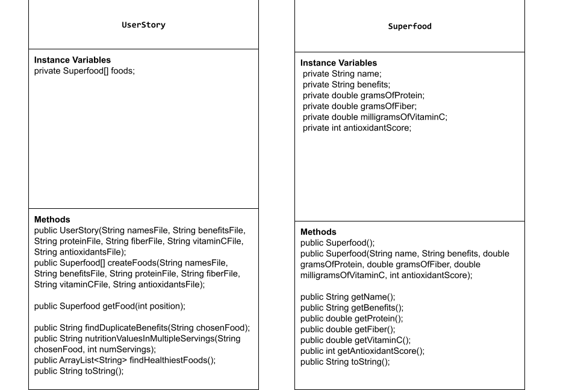

# Unit 3 - Data for Social Good Project 

## Introduction 

Software engineers develop programs to work with data and provide information to a user. Each user has different needs based on the information they are looking for from data. Your goal is to create a data analysis program for your user that stores and analyzes data to provide the information they need. 

## Requirements 

Use your knowledge of object-oriented programming, one-dimensional (1D) arrays, and algorithms to create your data analysis program: 
- **Write a class** – Write a class to represent your user or business and store and analyze their data with no-argument and parameterized constructors. 
- **Create at least two 1D arrays** – Create at least two 1D arrays to store the data that your user needs information about. 
- **Write a method** – Write a method that finds or manipulates the elements in a 1D array to provide the information your user needs. 
- **Implement a toString() method** – Write a toString() method that returns general information about the data (for example, number of values in the dataset). 
- **Document your code** – Use comments to explain the purpose of the methods and code segments and note any preconditions and postconditions. 

## User Story 

Include your User Story you analyzed for your project here. Your User Story should have the following format: 

> As a dietician,   
> I want to use a list of superfoods to sort them by benefit and find the most beneficial ones,   
> so that I can help make better diet recommendations to my patients depending on their situation. 

## Dataset 

Include a hyperlink to the source of your dataset used for this project. Additionally, provide a short description of each column used from the dataset, and the data type. 
 

Dataset: https://www.kaggle.com/datasets/prajwaldongre/top-100-healthiest-food-in-the-world 
- **Name** (String) - name of the food 
- **Nutrition Value (per 100g)** (String) - the key benefit(s) of this food 
- **Protein (g)** (double) - the number of grams of protein in a serving of this food
- **Fiber (g)** (double) - the number of grams of fiber in a serving of this food
- **Vitamin C (mg)** (double) - the number of milligrams of Vitamin C in this food
- **Antioxidant Score** (int) - a measurement of the antioxidant properties of the food 

## UML Diagram 

Put and image of your UML Diagram here. Upload the image of your UML Diagram to your repository, then use the Markdown syntax to insert your image here. Make sure your image file name is one work, otherwise it might not properly get display on this README. 

 

## Description 

In this project, I decided to create a story around a dietician looking to help support their patients with a detailed list of superfoods. To represent this, I first create the one instance variable that will be used in my main UserStory class, which is the array of foods. The data type of this array is that of an entity class known as Superfood[], where every single element in the 1D array of foods is created with their respective information. To do this, I initialized all the text files I used to become the data for each element, each of which was stored in another variable that was used to create each object. From there, I gave the Superfood class an accessor method for each instance variable (for each column), which were used in the methods of my main class. The first method took a food a user provided as an argument, found that food's benefit(s), and  traversed the rest of the benefits in a for-loop, with each matching food being concatenated to the final string result detailing all the similar food. The second method takes a user-provided food element and multiplies each of that food's nutrition values by a given number of servings. The third method found the overall most beneficial foods by using conditions equivalent to the recommend intake per meal. Each element in the foods array was traversed, with every element meeting at least one of the criteria being added to an array list. Afterwards a nested loop is used to find elements that were added at least twice, and those foods were added to the final array list to be returned. All of these methods along with other methods not mentioned here came together to help this dietician solve their problems by creating the needed reports.
